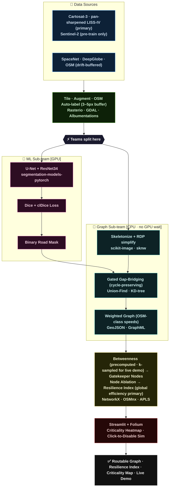

# System Architecture & Data-Flow Diagram
_Issue #2 — Route Resilience Pipeline_

Two sub-teams run in parallel. ML builds the model; Graph builds the analysis pipeline on OSM mock data. They merge at the road mask.

---



---

## Export to PNG / SVG

```bash
npm install -g @mermaid-js/mermaid-cli
mmdc -i docs/architecture.md -o docs/architecture.png -w 1920
```

Or paste the diagram block into [mermaid.live](https://mermaid.live) → Download PNG.
